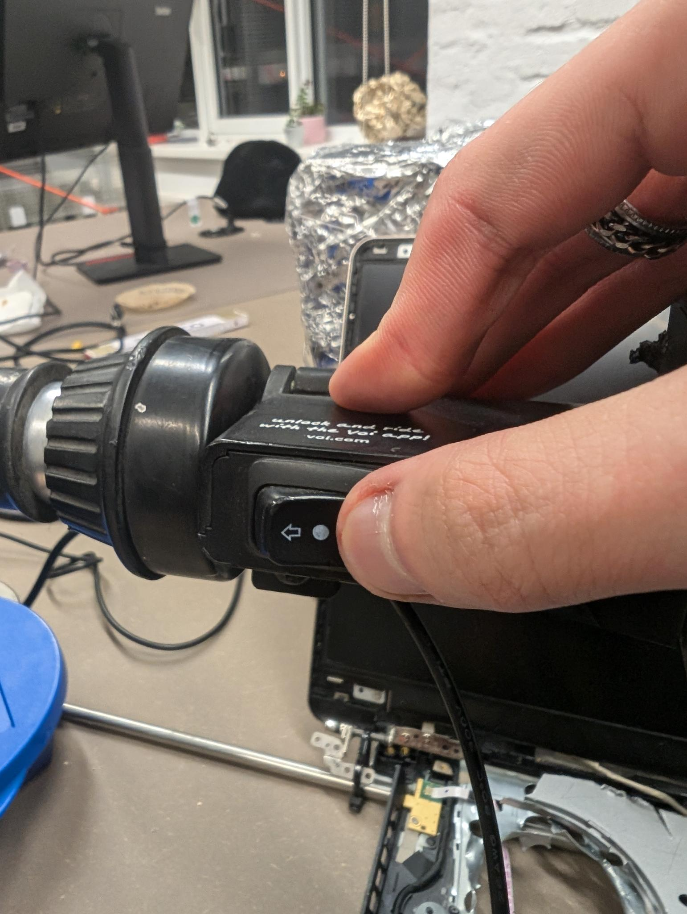
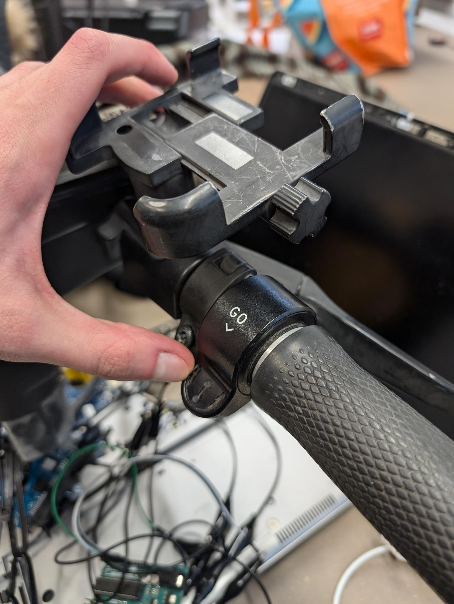
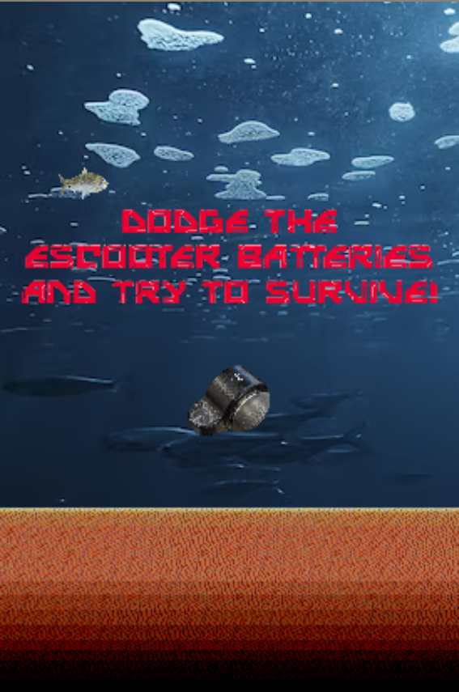
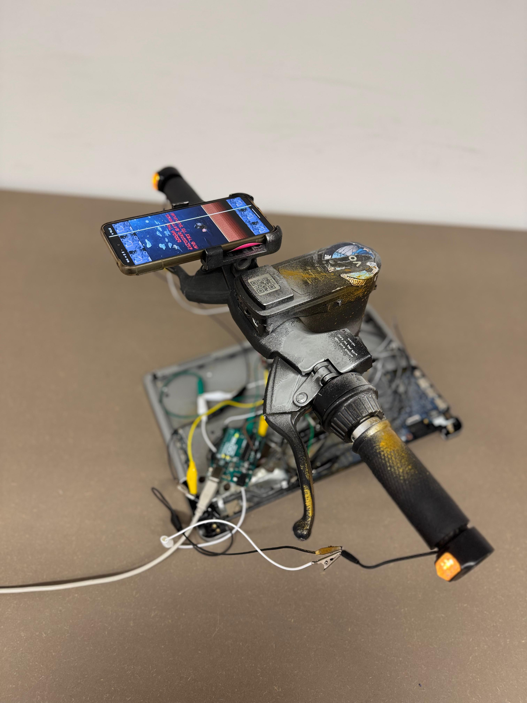

technisch gesehen war das ganze gegen die erwartungen eigentlich recht simpel

wir haben zu erst geschaut, wie einfach wir an die sensorik des lenkrads überhaupt rankommen

Schnell haben wir rausgefunden, dass der Schalter für die Blinker und der Beschleuninger einfache elektronische Komponenten sind, die man anzapfen kann
- Der Beschleuniger ist nur ein einfacher 3-Pin Pontiometer (Eingang (VCC), Ausgang (GND), und der Datapin).
- Der Schalter ist ein 4 Pin Switch, den man ebenfalls ganz einfach am Arduino auslesen kann. Dieser kann 3 "States" haben: Links, Mitte und rechts

Die Daten des Switches und des Potentiometers lesen wir mit Hilfe eines Arduinos aus und senden diese an den Computer

Der Computer liest diese Daten im Browser mit Hilfe der "Web Serial API" aus. Diese Daten werden dann vom Spiel verarbeitet

Das Spiel ist ein Re-Skin einer Open-Source Flappy Bird Implementation von "aaarafat": https://github.com/aaarafat/JS-Flappy-Bird
- Texturen wurden geändert in einen Unterwasser Stil und der Vogel wurde mit einem Fisch ausgetauscht
- Die Logik des Spiels wurden geändert, sodass der Vogel, wie normal in "Flappy Bird", keine Schwerkraft mehr hat, sondern lediglich durch die Position des Potentiometers kontrolliert wird
- Mit dem Switch kann man kontrollieren, ob ein schwarzes Overlay über den Bildschirm gelegt wird. Das ist der "On-Off Switch". Wenn der Vogel stirbt, kann man das Spiel neustarten, in dem man den Bildschirm aus und wieder an macht.

Zu guter Letzt haben wir die für die Ästhetik die LEDs des Blinkers noch zu einer 9V Batterie angeschlossen

